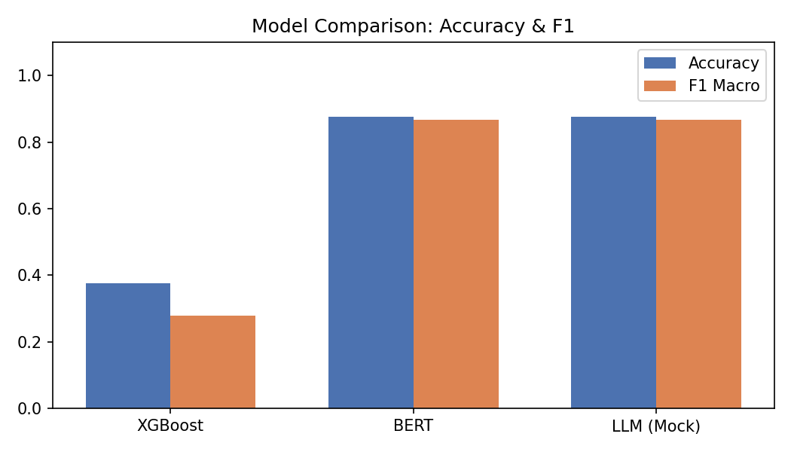
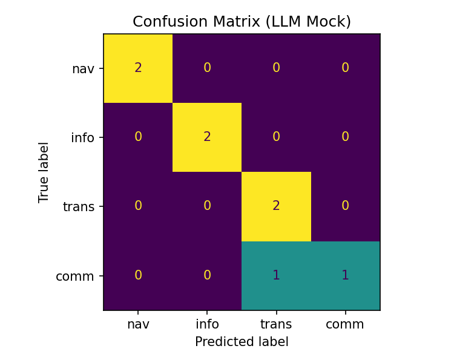

# 🔍 Search Query Intent Classifier

検索クエリ意図分類システム | End-to-End NLP Pipeline

## 📌 プロジェクト概要

ユーザーの検索クエリを以下の4つの意図に分類するシステムを構築しました。

| ラベル | 説明 | 例 |
|--------|------|----|
| Navigational | 特定サイトへ移動したい | `gmail login` |
| Informational | 情報を調べたい | `how to make sushi` |
| Transactional | 購入・操作をしたい | `buy iphone 15` |
| Commercial | 比較・調査したい | `best laptop 2024` |

## 🏗️ システム構成
data_prep.py       # データ前処理・特徴量エンジニアリング
baseline_xgb.py    # TF-IDF + XGBoost ベースライン
bert_finetune.py   # BERT fine-tuning（PyTorch + HuggingFace）
llm_labeling.py    # LLMベース分類・疑似ラベル生成
api.py             # FastAPI 推論エンドポイント

## 📊 モデル比較結果

| Model | Accuracy | F1 (macro) |
|-------|----------|------------|
| XGBoost + TF-IDF | 0.375 | 0.278 |
| BERT fine-tuning | **0.875** | **0.867** |
| LLM (Mock) | 0.875 | 0.867 |

BERTはXGBoostに比べてF1スコアが**+0.59**向上。

## 🚀 実行方法

### 環境構築
```bash
python -m venv venv
venv\Scripts\Activate.ps1  # Windows
pip install -r requirements.txt
```

### パイプライン実行
```bash
python data_prep.py       # データ準備
python baseline_xgb.py    # XGBoost学習
python bert_finetune.py   # BERT学習
python llm_labeling.py    # LLM分類・可視化
```

### API起動
```bash
python -m uvicorn api:app --reload
```

### API呼び出し例
```bash
# PowerShell
Invoke-RestMethod -Uri "http://127.0.0.1:8000/predict" \
  -Method Post -ContentType "application/json" \
  -Body '{"query": "buy iphone 15"}'

# レスポンス
# query: "buy iphone 15" | intent: "transactional" | label_id: 2
```

## 🛠️ 技術スタック

- **データ処理**: pandas, scikit-learn
- **Baseline**: XGBoost, TF-IDF
- **深層学習**: PyTorch, HuggingFace Transformers (BERT)
- **LLM**: OpenAI API対応（モック実装で差し替え可能）
- **サービング**: FastAPI, Uvicorn

## 📈 結果可視化


